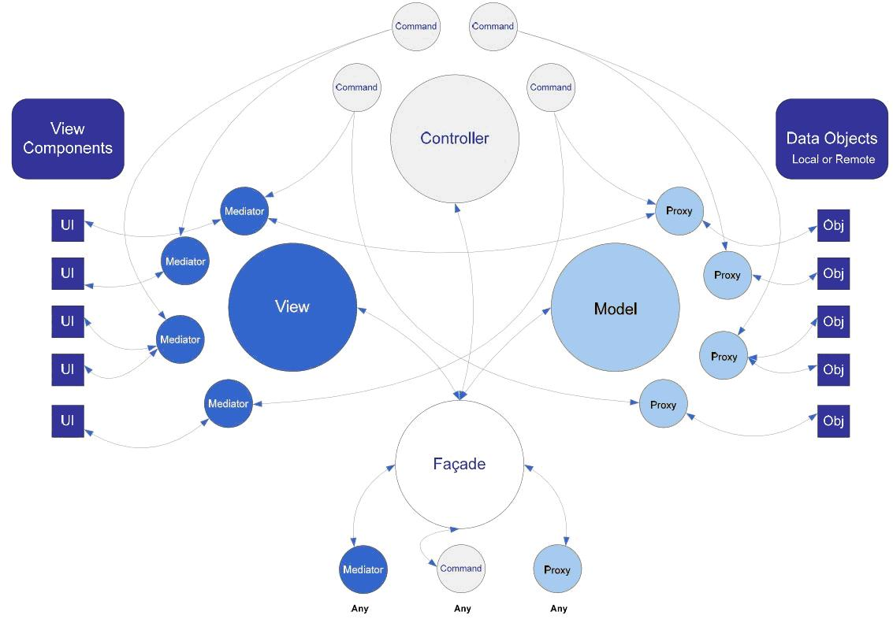

puremvc typescript 版本。。。

</img>

在 PureMVC 实现的经典 MVC 元设计模式中，Model、View 和 Controller 分别由一个单例类来管理，合称为核心层或核心角色。 另外，在 PureMVC 中还提供了一个单例类 —— Façade，主要作用是作为与核心层通信的唯一接口，简化开发复杂度。

从上图中可以看出，除了这几个主要对象以外，框架还有如下类 Proxy、Mediator 和 Command，以下简单介绍一下他们的作用。

Proxy 对象负责操作数据模型，与远程服务通信存取数据，这样可以保证 Model 层的可移植性。通常 Proxy 对象的引用保存在 Model 中。
View 保存对 Mediator 对象的引用。由 Mediator 对象来操作具体的视图组件（View Component，它的作用还包括：添加事件监听器，发送或接收 Notification，直接改变视图组件的状态。通过这样，就可以把视图和控制它的逻辑分离开来。
Command 对象是无状态的，只在需要时才被创建。Command 可以获取 Proxy 对象并与之交互，发送 Notification，执行其他的 Command。经常用于复杂的或系统范围的操作，如应用程序的“启动”和“关闭”。应用程序的业务逻辑应该在这里实现。
除了基本的对象结构以外，为了解耦合，PureMVC 框架中引入了事件机制，这是个非常简单观察者设计模式，所有的事件都是一个 Notification，不同对象之间通过 Notification 来同步操作和交换信息。例如如果想更新界面中某个 Mediator，首先我们定义 Notification 用于此目的，然后注册 Mediator 监听该 Notification，然后就可以在程序中任何地方生成一个 Notification，通过事件机制，Mediator 就会接收到 Notification，然后更新需要的部分。整个过程 Mediator 只和 Notification 有关，没有其他依赖，有效的降低了对象之间的依赖程度。

介绍完 PureMVC 的基本结构和事件模型，我们来看看一个典型的 PureMVC 应用如何构造。首先实际的应用程序都有一个 Façade 子类，这个 Façade 类对象负责初始化 Controller（控制器），建立 Command 与 Notification 名之间的映射，并执行一个 Command 注册所有的 Model 和 View，一旦初始化的工作做完，对象之间的关系建立好以后，应用程序就可以正常运行了。